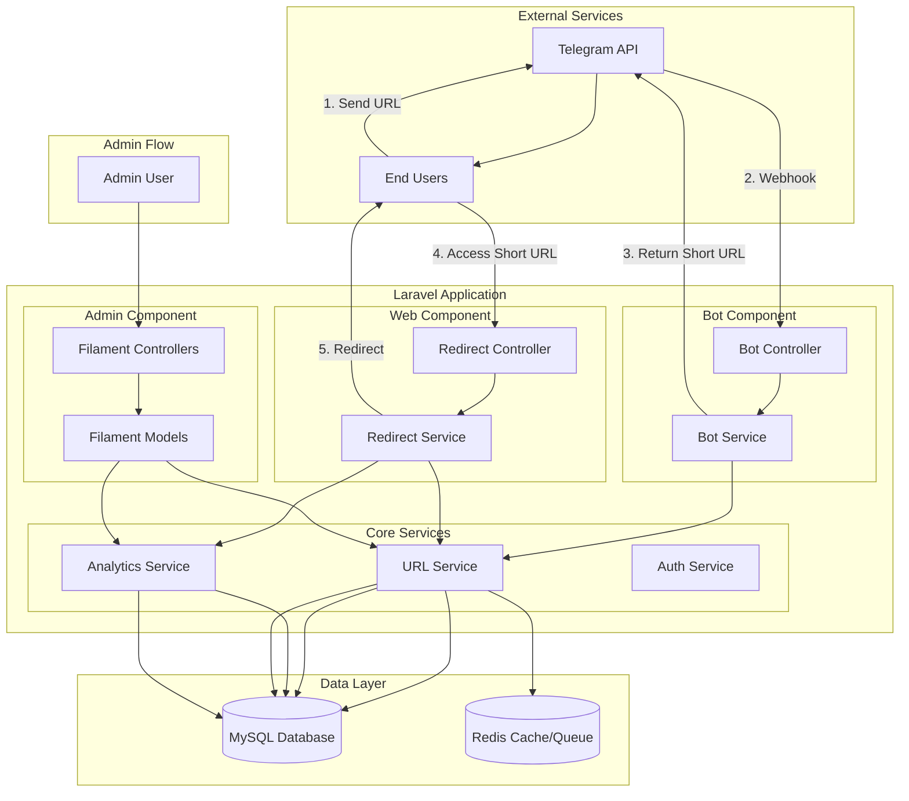
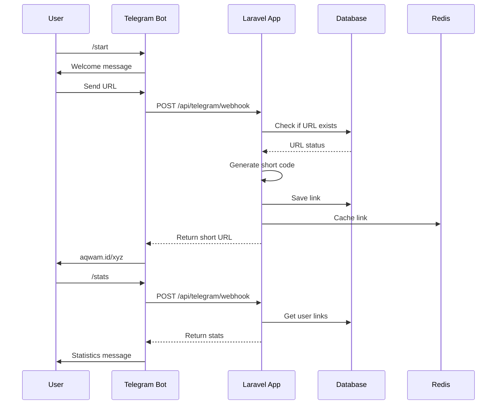

# Analisis Arsitektur Lengkap Sistem Telegram URL Shortener

## 1. Analisis Kebutuhan Sistem

Berdasarkan informasi yang dikumpulkan, berikut adalah kebutuhan sistem untuk Telegram URL Shortener:

### Kebutuhan Fungsional:
- Bot Telegram untuk menerima URL dari pengguna dan menghasilkan short URL
- Sistem redirect URL yang cepat dan efisien
- Dashboard admin untuk manajemen link dan analytics
- Tracking analytics lengkap (lokasi, device, browser)
- Fokus pada domain tunggal: aqwam.id

### Kebutuhan Non-Fungsional:
- Performa tinggi untuk redirect URL
- Keamanan data dan akses
- Scalability untuk menangani traffic tinggi
- Rate limiting untuk mencegah abuse
- Monitoring dan logging

### Komponen Sistem:
1. **Telegram Bot** - Interface untuk pengguna
2. **URL Shortener Service** - Logika pembuatan dan pengelolaan short URL
3. **Redirect Service** - Handle redirect dari short URL ke long URL
4. **Admin Dashboard** - Interface manajemen menggunakan Filament
5. **Analytics Service** - Tracking dan pelaporan pengunjung
6. **Database** - Penyimpanan data (MySQL)

## 2. Arsitektur Sistem

### Overview Arsitektur
```
┌─────────────┐    ┌─────────────────┐    ┌─────────────────┐
│  Telegram   │    │                 │    │                 │
│    Bot      │◄──►│   Laravel App    │◄──►│  Admin Dashboard│
│             │    │                 │    │    (Filament)   │
└─────────────┘    │                 │    │                 │
                   │                 │    └─────────────────┘
                   │                 │
                   │                 │    ┌─────────────────┐
                   │                 │◄──►│                 │
                   │                 │    │   MySQL Database│
                   │                 │    │                 │
                   │                 │    └─────────────────┘
                   │                 │
                   │                 │    ┌─────────────────┐
                   │                 │◄──►│                 │
                   │                 │    │      Redis      │
                   │                 │    │   (Cache/Queue) │
                   └─────────────────┘    └─────────────────┘
```

### Alur Data Sistem:
1. **Pembuatan Short URL:**
   - User mengirim URL ke Telegram Bot
   - Bot mengirim request ke Laravel API
   - Laravel generate short code dan simpan ke database
   - Bot mengembalikan short URL ke user

2. **Redirect URL:**
   - User mengakses short URL (aqwam.id/xyz)
   - Laravel menerima request dan lookup short code di database
   - Log analytics data (IP, user agent, dll)
   - Redirect ke long URL

3. **Admin Dashboard:**
   - Admin login ke Filament dashboard
   - View/manage links dan analytics
   - CRUD operations untuk links dan admins

## 3. Diagram Arsitektur Sistem



## 4. Skema Database

### Tabel: links
```sql
CREATE TABLE links (
    id BIGINT PRIMARY KEY AUTO_INCREMENT,
    short_code VARCHAR(10) UNIQUE NOT NULL,
    long_url TEXT NOT NULL,
    is_custom BOOLEAN DEFAULT FALSE,
    created_at TIMESTAMP DEFAULT CURRENT_TIMESTAMP,
    updated_at TIMESTAMP DEFAULT CURRENT_TIMESTAMP ON UPDATE CURRENT_TIMESTAMP,
    clicks INT DEFAULT 0,
    INDEX idx_short_code (short_code),
    INDEX idx_created_at (created_at)
);
```

### Tabel: click_logs
```sql
CREATE TABLE click_logs (
    id BIGINT PRIMARY KEY AUTO_INCREMENT,
    short_code VARCHAR(10) NOT NULL,
    ip_address VARCHAR(45) NOT NULL,
    user_agent TEXT,
    referer VARCHAR(500),
    country VARCHAR(2),
    city VARCHAR(100),
    device_type VARCHAR(50),
    browser VARCHAR(100),
    browser_version VARCHAR(50),
    os VARCHAR(100),
    os_version VARCHAR(50),
    timestamp TIMESTAMP DEFAULT CURRENT_TIMESTAMP,
    FOREIGN KEY (short_code) REFERENCES links(short_code) ON DELETE CASCADE,
    INDEX idx_short_code (short_code),
    INDEX idx_timestamp (timestamp),
    INDEX idx_ip_address (ip_address)
);
```

### Tabel: admins
```sql
CREATE TABLE admins (
    id BIGINT PRIMARY KEY AUTO_INCREMENT,
    telegram_user_id BIGINT UNIQUE NOT NULL,
    username VARCHAR(100),
    password_hash VARCHAR(255) NOT NULL,
    email VARCHAR(255),
    is_active BOOLEAN DEFAULT TRUE,
    created_at TIMESTAMP DEFAULT CURRENT_TIMESTAMP,
    updated_at TIMESTAMP DEFAULT CURRENT_TIMESTAMP ON UPDATE CURRENT_TIMESTAMP,
    INDEX idx_telegram_user_id (telegram_user_id),
    INDEX idx_username (username)
);
```

### Tabel: failed_jobs (untuk queue system)
```sql
CREATE TABLE failed_jobs (
    id BIGINT PRIMARY KEY AUTO_INCREMENT,
    uuid VARCHAR(255) UNIQUE NOT NULL,
    connection TEXT NOT NULL,
    queue TEXT NOT NULL,
    payload LONGTEXT NOT NULL,
    exception LONGTEXT NOT NULL,
    failed_at TIMESTAMP DEFAULT CURRENT_TIMESTAMP
);
```

### Tabel: jobs (untuk queue system)
```sql
CREATE TABLE jobs (
    id BIGINT PRIMARY KEY AUTO_INCREMENT,
    queue VARCHAR(255) NOT NULL,
    payload LONGTEXT NOT NULL,
    attempts TINYINT UNSIGNED NOT NULL,
    reserved_at INT UNSIGNED NULL,
    available_at INT UNSIGNED NOT NULL,
    created_at INT UNSIGNED NOT NULL,
    INDEX idx_queue (queue),
    INDEX idx_reserved_at (reserved_at),
    INDEX idx_available_at (available_at)
);
```

## 5. Teknologi dan Library

### Backend Stack:
- **Framework:** Laravel 11
- **Database:** MySQL 8.0+
- **Cache/Queue:** Redis
- **Admin Panel:** Filament
- **Telegram Bot:** Telegram Bot API SDK

### Library yang Diperlukan:
```json
{
    "require": {
        "laravel/framework": "^11.0",
        "filament/filament": "^3.0",
        "telegram-bot/sdk": "^3.0",
        "jenssegers/agent": "^2.6",
        "geoip2/geoip2": "^2.13",
        "predis/predis": "^2.0"
    }
}
```

### Additional Services:
- **GeoIP Service:** MaxMind GeoIP2 untuk deteksi lokasi
- **User Agent Parser:** Jenssegers Agent untuk device/browser detection

## 6. Struktur Endpoint API

### Telegram Bot Endpoints:
```php
// Telegram Webhook
POST /api/telegram/webhook
```

### Redirect Endpoints:
```php
// Redirect from short URL
GET /{short_code}
```

### Admin API Endpoints (internal untuk Filament):
```php
// Links Management
GET    /api/admin/links
POST   /api/admin/links
GET    /api/admin/links/{id}
PUT    /api/admin/links/{id}
DELETE /api/admin/links/{id}

// Analytics
GET    /api/admin/analytics/overview
GET    /api/admin/analytics/links/{id}
GET    /api/admin/analytics/clicks

// Admin Management
GET    /api/admin/admins
POST   /api/admin/admins
PUT    /api/admin/admins/{id}
DELETE /api/admin/admins/{id}
```

## 7. Alur Kerja Telegram Bot



### Bot Commands:
- `/start` - Welcome message dan instruksi
- `/help` - Bantuan dan daftar perintah
- `/stats` - Statistik link yang dibuat user
- Default behavior - Menerima URL dan generate short URL

## 8. Struktur Dashboard Admin dengan Filament

### Resource Panels:
1. **Links Resource**
   - List semua short URLs
   - Filter berdasarkan tanggal, jumlah klik
   - Detail view dengan analytics chart
   - Bulk actions (delete, export)

2. **Analytics Dashboard**
   - Overview chart (klik per hari/minggu/bulan)
   - Top URLs berdasarkan klik
   - Geographic distribution map
   - Device/browser breakdown
   - Traffic sources

3. **Admins Resource**
   - Manajemen admin users
   - Role-based access control
   - Activity logs

4. **Settings Page**
   - Konfigurasi bot token
   - Domain settings
   - Rate limiting configuration

### Custom Filament Pages:
- `AnalyticsOverviewPage` - Dashboard dengan charts dan metrics
- `LinkAnalyticsPage` - Detail analytics untuk specific link
- `SystemHealthPage` - Monitoring sistem performance

## 9. Aspek Keamanan, Rate Limiting, dan Validasi Input

### Keamanan:
1. **Input Validation:**
   - Validasi URL format dengan regex
   - Sanitasi input untuk mencegah XSS
   - Filter domain berbahaya (phishing, malware)

2. **Authentication & Authorization:**
   - Admin authentication dengan Laravel Auth
   - Role-based access control di Filament
   - Two-factor authentication untuk admin

3. **Data Protection:**
   - Hash password dengan bcrypt
   - HTTPS enforcement
   - CSRF protection
   - SQL injection prevention dengan Eloquent ORM

### Rate Limiting:
1. **Telegram Bot:**
   - Rate limiting per user (5 requests/minute)
   - Global rate limiting (1000 requests/minute)

2. **Redirect Service:**
   - Rate limiting per IP (100 requests/minute)
   - DDoS protection dengan Redis

3. **Admin Dashboard:**
   - Login attempt limiting (5 attempts/5 minutes)
   - Session timeout

### Validasi Input:
1. **URL Validation:**
   ```php
   'url' => 'required|url|max:2048|active_url'
   ```

2. **Short Code Validation:**
   ```php
   'short_code' => 'required|alpha_num|min:3|max:10|unique:links,short_code'
   ```

3. **Admin Registration:**
   ```php
   'telegram_user_id' => 'required|integer|unique:admins,telegram_user_id',
   'password' => 'required|min:8|confirmed'
   ```

## 10. Rekomendasi Implementasi dan Deployment

### Development Environment:
1. **Local Setup:**
   - Laravel Sail dengan Docker
   - MySQL 8.0 dan Redis containers
   - Local domain setup untuk aqwam.test

2. **Development Workflow:**
   - Git branching strategy (GitFlow)
   - Automated testing dengan PHPUnit
   - Code quality checks dengan Laravel Pint

### Production Environment:
1. **Server Requirements:**
   - PHP 8.2+
   - MySQL 8.0+
   - Redis 6.0+
   - Nginx/Apache web server
   - SSL certificate

2. **Deployment Strategy:**
   - CI/CD pipeline dengan GitHub Actions
   - Zero-downtime deployment
   - Database migrations
   - Asset optimization

3. **Scaling Considerations:**
   - Horizontal scaling dengan load balancer
   - Read replicas untuk database
   - Redis cluster untuk cache/queue
   - CDN untuk static assets

4. **Monitoring:**
   - Application monitoring dengan Laravel Telescope
   - Error tracking dengan Sentry
   - Performance monitoring
   - Uptime monitoring

### Implementation Phases:
1. **Phase 1: Core Functionality**
   - Basic URL shortening
   - Simple redirect
   - Basic Telegram bot

2. **Phase 2: Analytics**
   - Click tracking
   - Basic analytics dashboard
   - GeoIP integration

3. **Phase 3: Advanced Features**
   - Advanced analytics
   - Admin dashboard dengan Filament
   - Rate limiting and security

4. **Phase 4: Optimization**
   - Performance optimization
   - Caching strategies
   - Scaling preparation

### Cost Estimation:
- **Development:** 2-3 weeks untuk MVP
- **Infrastructure:** $20-50/month untuk production
- **Domain:** $10-15/year untuk aqwam.id
- **SSL:** Free dengan Let's Encrypt
- **Monitoring:** $0-20/month tergantung provider

## 11. Struktur Direktori Proyek

```
aqwam/
├── app/
│   ├── Http/
│   │   ├── Controllers/
│   │   │   ├── Api/
│   │   │   │   ├── TelegramController.php
│   │   │   │   └── RedirectController.php
│   │   │   └── Admin/
│   │   ├── Requests/
│   │   └── Middleware/
│   ├── Models/
│   │   ├── Link.php
│   │   ├── ClickLog.php
│   │   └── Admin.php
│   ├── Services/
│   │   ├── TelegramBotService.php
│   │   ├── UrlShortenerService.php
│   │   ├── AnalyticsService.php
│   │   └── GeoIpService.php
│   └── Filament/
│       ├── Resources/
│       │   ├── LinkResource.php
│       │   └── AdminResource.php
│       └── Pages/
│           └── AnalyticsOverview.php
├── database/
│   ├── migrations/
│   └── seeders/
├── routes/
│   ├── api.php
│   └── web.php
└── config/
    └── telegram.php
```

## 12. Kesimpulan

Arsitektur ini dirancang untuk:
- **Scalability:** Dapat menangani traffic tinggi dengan caching dan queue system
- **Maintainability:** Struktur yang terorganisir dengan separation of concerns
- **Security:** Multiple layers of security protection
- **Performance:** Optimized untuk redirect speed dengan caching
- **Analytics:** Comprehensive tracking dan reporting capabilities

Dengan menggunakan Laravel sebagai foundation dan Filament untuk admin panel, sistem ini akan mudah dikembangkan dan dipelihara, sambil tetap menyediakan fitur-fitur canggih untuk manajemen URL shortener.